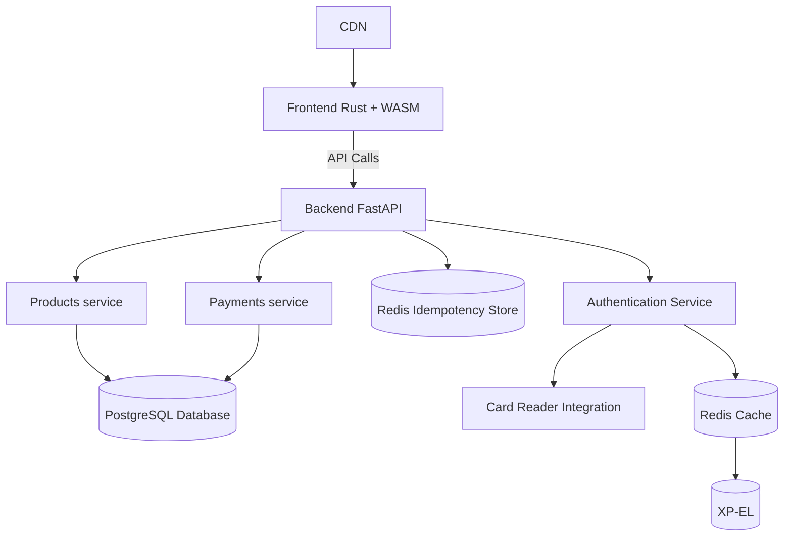

# Bättre Bosh Project Proposal

**Course**: Design of Dynamic Web Systems (M7011E)  
**Team Members**: [Malcolm Ovin, Olle Ronstad, Justin Gavrell]  
**Date**: [7/11/2025]

---

## 1. Problem Statement & Solution

**Problem**: [1-2 sentences describing the real-world problem]

_Currently xp-el uses a manual honor based system to handle transactions with their fika system (fridge). This leaves xp-el open
to fraud and honest mistakes costing them money_

**Solution**: [1-2 sentences describing your dynamic web system solution]

_Our platform, bättre boch (BB), offers students a better and more secure way of interacting with the xp-el fika
system. Allowing xp-el to have a better overview of their customers, products and transactions as to minimize fraud and mistakes._

**Why Dynamic?**: [Explain how content changes based on user interactions or data]

_The system is dynamic as to allow for an real time view of xp-el stock and their own personal funds. In addition the system handles dynamic login and logout from the card readers._

## 2. Core Features

**Main Features** (4-5 key capabilities):

1. **[Stock products]**: [An xp-el admin user can restock products]
2. **[Buy product(s)]**: [A user can buy products from the online store]
3. **[Transaction history]**: [The application keeps a detailed transaction history allowing for data processing]
4. **[card reader]**: [A card reader allowing for physical auth]

## 3. Target Users

**Primary Users**: [Who will use this system?]

This user an xp-el member.

**Key User Journey**: [1-2 sentences showing how a typical user interacts with your system]

The user logs in using their student card at the card reader, browses the available products on the online store, selects items to purchase, and completes the transaction. The system updates their balance and provides a digital receipt of the transaction.

## 4. Technology Stack

**Frontend**: [rust wasm] - _Justification: [can leverage WebAssembly for performance-critical tasks and can later be ported to other platforms such as embedded systems]_
**Backend**: [Python with FastAPI] - _Justification: [FastAPI is lightweight, easy to use, and supports asynchronous programming, making it suitable for building scalable web services.]_
**Caching**: [Redis] - _Justification: [In-memory data structure store, used as a database, cache, and message broker. Ideal for caching frequently accessed data to improve performance.
Especially between the singular xp-el SQLite server and the rest of the application.]_
**Database**: [PostgreSQL] - _Justification: [Relational database with strong consistency guarantees (ACID), suitable for handling financial transactions and user data.]_

## 5. System Architecture

**Architecture Overview**:


<!-- ```
[Simple diagram showing main components]
Frontend <-> API <-> Services <-> Database
                 <-> Auth Service
                 <-> [Other Services]
``` -->

**Microservices Plan**:

- **[Auth Service]**: [Handles user authentication and authorization, if needed queries xp-el for a unknown user to get their details]
- **[Offsite user checking/Card Reader]**: [This allows for auth via the physical card reader device]
- **[Payments Service]**: [Handles payment processing and transaction management, this also reduces stock on purchases]
- **[Products Service]**: [Manages product listings, stock levels, and product details]

## 6. Requirements Fulfillment

**Core Requirements**: All REQ1-REQ39 will be implemented through:

- Dynamic content via
  - Real-time stock updates
  - User-specific transaction history
  - Authentication via card reader (website on device updates when card reader is used)
- Microservices architecture with [service breakdown]
  - Authentication Service
  - Payments Service
  - Products Service
  - Card Reader Integration service
- Testing strategy achieving 50%+ coverage
  - Unit tests for individual services
  - Integration tests for service interactions
  - (ci/cd pipeline with automated testing and static type checking)
- Kubernetes deployment with monitoring
  - No monitoring solution decided yet but we will look into options such as Prometheus or Grafana

**Advanced Feature**: **Option [A/B/C/D/E]** - [Brief implementation plan]

We will decide this in future weeks but we are leaning towards some form of advanced security feature due to the need for enhanced user authentication and transaction security.

**Target Grade**: [3/4/5] - _Justification: [Why this target is realistic]_

we target grade 5 as we believe our project scope and team skills align well with the requirements for this grade.
The integration of a physical card reader adds complexity, but with careful planning and execution, we are confident in our ability to deliver a robust solution that meets all specified criteria.
We believe our capabilities extend more than far enough to implement any advanced feature chosen, this is especially the case regarding security due to My(Olle) and Malcolm's expertise in secure systems
and the time we have spent under Prof. Per Lindgren developing systems in rust.

## 7. Development Plan

Rough development timeline:

**continuous tasks**: Testing, documentation, code reviews, CI/CD setup

**Weeks 1-2**: Database schema, basic services, authentication, Kubernetes self-host setup
**Weeks 3-4**: Core features, API implementation, CI/CD pipeline
**Weeks 5-6**: Advanced feature, comprehensive testing, security
**Weeks 7-8**: performance analysis, final polish

## 8. Risk Assessment

**Main Risks**:

- **Technical**: [Integration of card reader with backend, due to hardware-software interaction complexities as well as ltu uses a proprietary system, mifare 1k]
  - _Mitigation_: Early prototyping and testing of card reader integration.
- **Scope**: [Feature creep leading to missed deadlines]
  - _Mitigation_: Strict prioritization of features and regular progress reviews.

- **Fallback Plan**: [Minimum viable features for Grade 3]
  - No card reader integration, basic web interface for manual login
  - Basic product listing and purchasing without advanced security features
  - No redis caching, direct database access for simplicity

## 9. Team Organization

**[Malcolm]**: [API development, database design, backend services]
**[Olle]**: [user interface design, card reader integration, kubernetes deployment, and CI/CD pipeline]
**[Justin]**: [To be decided based on project needs]
**[AI]**: [Frontend]

**Approval Request**: We request approval to proceed with this project concept and technology stack.
