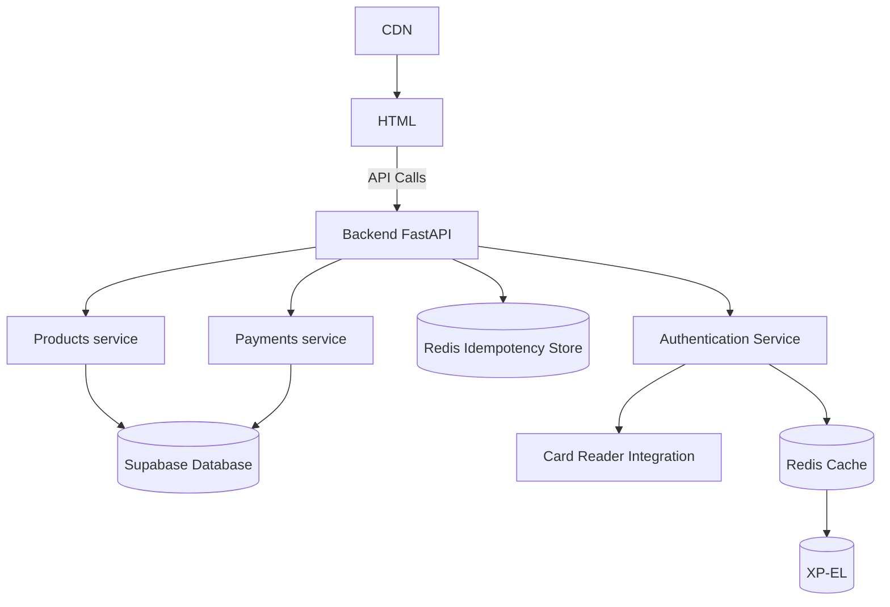

# BB-M7011E
 
**Development Team**: [Malcolm Ovin, Olle Ronstad, Justin Gavrell]  

---

## Core Features

1. **[Stock products]**: [An xp-el admin user can restock products]
2. **[Buy product(s)]**: [A user can buy products from the online store]
3. **[Transaction history]**: [The application keeps a detailed transaction history allowing for data processing]
4. **[card reader]**: [A card reader allowing for physical auth] ( Developmnet in backlog)

## 4. Technology Stack

**Frontend**: [HTML]
**Backend**: [Python with FastAPI]
**Caching**: [Redis]
**Database**: [Supabase] 

## 5. System Architecture

**Architecture Overview**:


<!-- ```
[Simple diagram showing main components]
Frontend <-> API <-> Services <-> Database
                 <-> Auth Service
                 <-> [Other Services]
``` -->

# Guide — Deploying Bättre Bösch

This guide explains how to deploy the project and its services using the `deploy-all.sh` script located in this folder.

## Overview

`/deploy-all.sh` is a helper that builds (unless skipped), pushes container images, sets up cluster namespaces/secrets, and deploys services to one or more environments (dev, staging, prod).

It orchestrates the following scripts in this directory:

- `setup-cluster.sh` — prepares namespaces and secrets for an environment
- `build-and-push.sh` — builds container images and pushes them (uses `TAG`)
- `deploy-services.sh` — deploys the microservices to the target environment

## Prerequisites

- `bash` (script is POSIX-compatible; tested on macOS/Linux)
- `docker` and permissions to build & push images
- `kubectl` configured for the target cluster(s)
- `helm` (if the project uses Helm charts within `deploy-services.sh`)
- Credentials / access required by `build-and-push.sh` (Docker registry auth)
- Ensure your kube context is set to the correct cluster before running

## Environment variables / flags

- `ENV` (required) — target environment: `dev`, `staging`, `prod`, or `all`
- `TAG` (optional) — image tag to build & deploy (default: `latest`)
- `SKIP_BUILD` (optional) — if set to `true`, skips the build-and-push step

Notes:
- Running `ENV=all` will prompt for confirmation and then deploy to `dev`, `staging`, and `prod` in sequence.
- When deploying to `all`, the script will build once (unless `SKIP_BUILD=true`) and reuse the same `TAG` for each environment.

## Basic usage

Deploy to a single environment (build + deploy):

```bash
ENV=dev ./scripts/deploy-all.sh
```

Deploy to a different environment with a specific tag:

```bash
ENV=staging TAG=v1.2.3 ./scripts/deploy-all.sh
```

Skip building/pushing images (useful when images already exist):

```bash
SKIP_BUILD=true ENV=staging ./scripts/deploy-all.sh
```

Deploy to all environments (will prompt for confirmation):

```bash
ENV=all ./scripts/deploy-all.sh
```

## Safety notes

- `ENV=all` will deploy to production as well — be sure you want that before confirming.
- Use unique `TAG` values (e.g., semantic versions or commit SHAs) for reproducible deployments.
