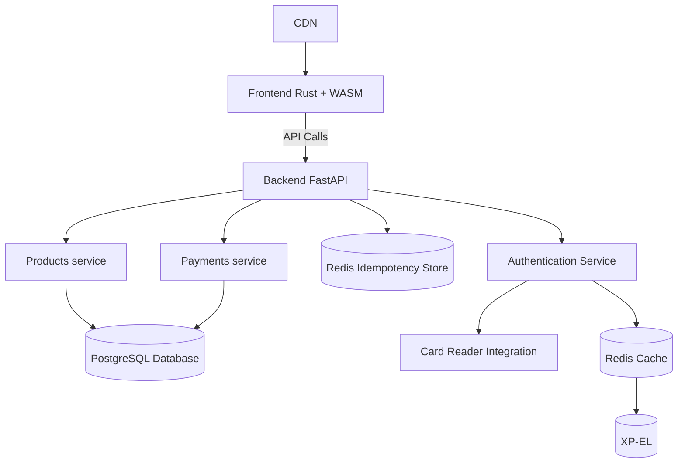

# Project Proposal Template

**Course**: Design of Dynamic Web Systems (M7011E)  
**Team Members**: [Malcolm Ovin, Olle Ronstad]  
**Date**: [5/11/2025]

---

## 1. Problem Statement & Solution

**Problem**: [1-2 sentences describing the real-world problem]

_Currelty xp-el uses a manual honor based system to handle transactions with their fika system (fridge). This leavs xp-el open
to fraud and honest mistakes costing them money_

**Solution**: [1-2 sentences describing your dynamic web system solution]

_Our platform, bättre boch (BB), offers students a better and more secure way of interacting with the xp-el fika
system. Allowing xp-el to have a beeter overview of their customers, products and transacctions as to mimimice fraud and mistakes._

**Why Dynamic?**: [Explain how content changes based on user interactions or data]

_Example: Students waste time coordinating study sessions through scattered messages. Our platform provides real-time study group matching that adapts recommendations based on user availability, course enrollment, and collaboration history._

The system is dynamic as to allow for an real time view of xp-el stock and their own personal funds. In addition the system handles dynamic login and logout from the card readers.

## 2. Core Features

**Main Features** (4-5 key capabilities):

1. **[Stock products]**: [An xp-el admin user can restock products]
2. **[Buy product(s)]**: [A user can buy products from the online store]
3. **[Transaction history]**: [The application keeps a detailed transaction history allowing for data processing]
4. **[card reader]**: [A card reader allwing for physical auth]

## 3. Target Users

**Primary Users**: [Who will use this system?]

This user an xp-el member.

**Key User Journey**: [1-2 sentences showing how a typical user interacts with your system]

The user logs in using their student card at the card reader, browses the available products on the online store, selects items to purchase, and completes the transaction. The system updates their balance and provides a digital receipt of the transaction.

## 4. Technology Stack

**Frontend**: [rust wasm] - _Justification: [can leverage WebAssembly for performance-critical tasks and can later be ported to other platforms]_
**Backend**: [Python with FastAPI] - _Justification: [FastAPI is lightweight, easy to use, and supports asynchronous programming, making it suitable for building scalable web services.]_
**Database**: [PostgreSQL] - _Justification: [Relational database with strong consistency guarantees (ACID), suitable for handling financial transactions and user data.]_

## 5. System Architecture

**Architecture Overview**:


<!-- ```
[Simple diagram showing main components]
Frontend <-> API <-> Services <-> Database
                 <-> Auth Service
                 <-> [Other Services]
``` -->

**Microservices Plan**:

- **[Offsite urer checking]**: [Purpose]
- **[Logging service (card terminal)]**: [Purpose]
- **[Money transfer sevice]**: [Purpose]
- more

## 6. Requirements Fulfillment

**Core Requirements**: All REQ1-REQ39 will be implemented through:

- Dynamic content via [specific examples]
- Microservices architecture with [service breakdown]
- Testing strategy achieving 50%+ coverage
- Kubernetes deployment with monitoring

**Advanced Feature**: **Option [A/B/C/D/E]** - [Brief implementation plan]

We will dicide this in future weeks but we are leaning towards some form of advanced security feature.

**Target Grade**: [3/4/5] - _Justification: [Why this target is realistic]_

## 7. Development Plan

Rough development timeline:
**Weeks 1-2**: Database schema, basic services, authentication, Kubernetes setup
**Weeks 3-4**: Core features, API implementation, CI/CD pipeline
**Weeks 5-6**: Advanced feature, comprehensive testing, security
**Weeks 7-8**: Documentation, performance analysis, final polish

## 8. Risk Assessment

**Main Risks**:

- **Technical**: [One key risk and mitigation]
- **Scope**: [One key risk and mitigation]

- **Technical**: [Integration of card reader with backend] - _Mitigation_: Early prototyping and testing of card reader integration.
- **Scope**: [Feature creep leading to missed deadlines] - _Mitigation_: Strict prioritization of features and regular progress reviews.

**Fallback Plan**: [Minimum viable features for Grade 3]

## 9. Team Organization

**[Malcolm]**: [API development, database design, backend services]
**[Olle]**: [user interface design, card reader integration]
**[AI]**: [Frontend]

**Approval Request**: We request approval to proceed with this project concept and technology stack.
