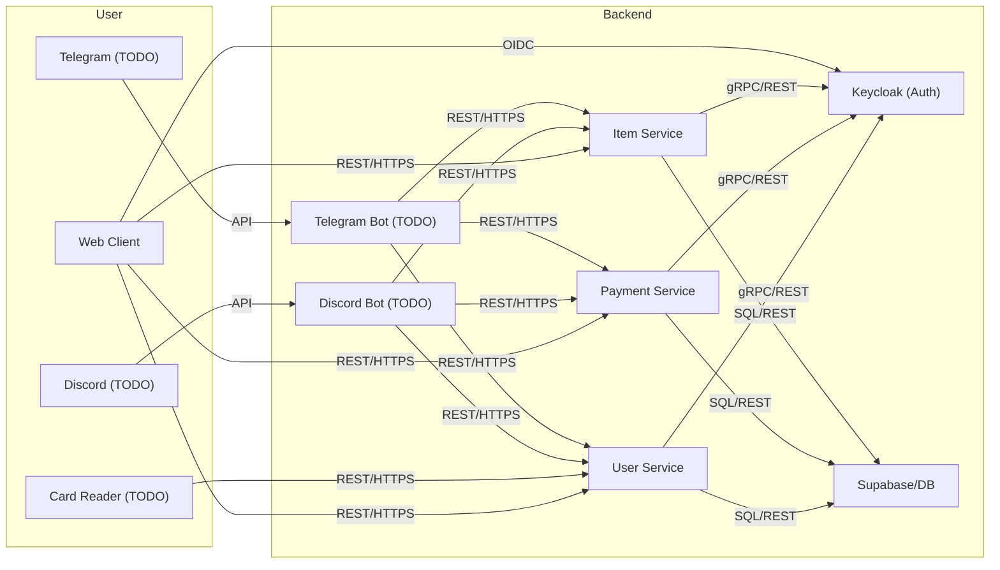
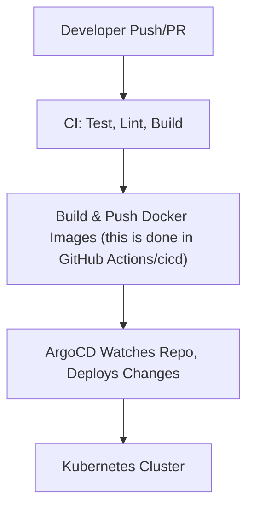
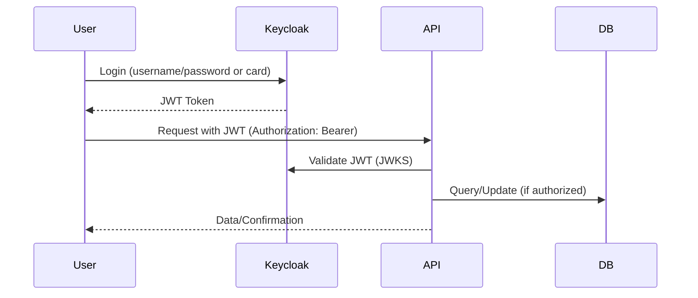
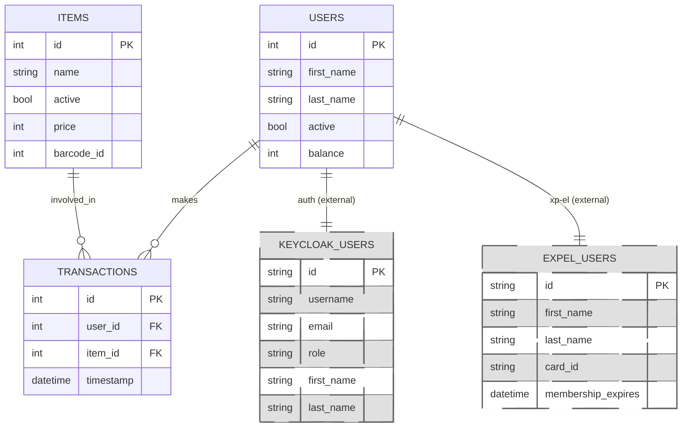
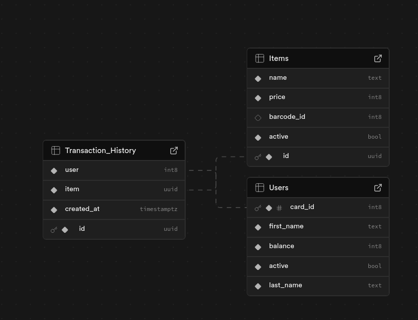

# Motivation: Why is This a Dynamic Web System?

- The system provides real-time, user-specific content and updates (e.g., balances, transaction history).
- User interactions (buying, logging in/out) immediately affect the data and UI for all users (e.g., balance updates, transaction records).
- Authentication and authorization are dynamic, adapting to user roles and session state.
- The backend is composed of microservices that communicate and update each other dynamically.
- Social network bots (Discord and Telegram) allow users to interact with the system in real time from multiple platforms, making the system even more dynamic and accessible.

---

# High-Level Architecture

## Microservices Overview

---

## GitOps CI/CD Pipeline

---

## Security Model & Secure Request Flow

- All service-to-service and user-to-service communication is over HTTPS.
- JWT tokens are validated using Keycloak’s JWKS endpoint.
- Role-based access control enforced in each microservice.

---

## Monitoring, Metrics, Logs, Traces

todo? do we have this yet?

---

# Database Schemas

> _Insert graphical ER diagrams or schema diagrams here. You can generate these using tools like dbdiagram.io, SQLDBM, or from your ORM/database migration files._

**Example:**

---

_Fill in each section with your system’s specifics and generated diagrams as needed._
